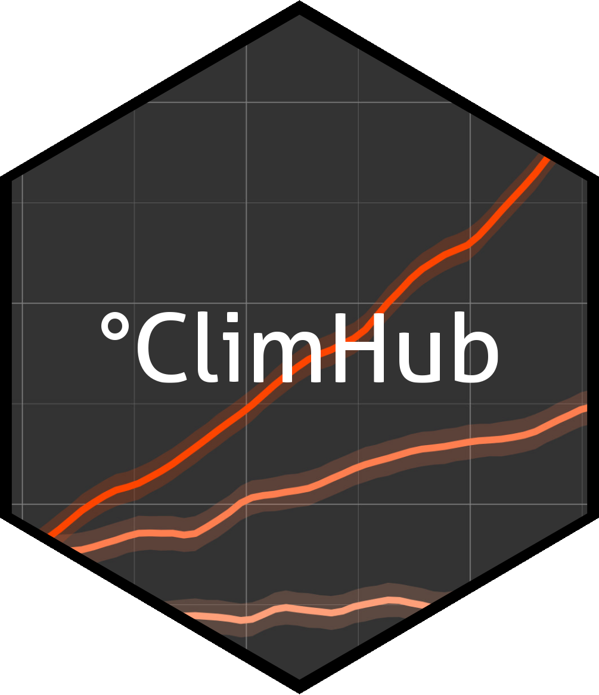

<!-- badges: start -->

<!-- change here for badges when ready -->

<!-- [](https://zenodo.org/badge/latestdoi/116978043)
[](https://codecov.io/gh/derek-corcoran-barrios/NetworkExtinction)
[](https://CRAN.R-project.org/package=NetworkExtinction)
[](https://github.com/derek-corcoran-barrios/NetworkExtinction/actions/workflows/R-CMD-check.yaml) -->


<!-- badges: end -->

<div style="border: 1px solid #f5c6cb; background-color: #f8d7da; color: #721c24; padding: 15px; border-radius: 5px; text-align: center;">
  ⚠️ <strong>The package is currently still in early development.</strong>
</div>

# ClimHub



`ClimHub` is an R Package for downloading and processing a variety of climate data products. The package interfaces with select data products provided by:
1. The [Climate Data Store (CDS)](https://cds.climate.copernicus.eu/#!/home) hosted by the [Copernicus Climate Change Service (C3S)](https://cds.climate.copernicus.eu/about-c3s) of the [European Centre for Medium-Range Weather Forecasts (ECMWF)](https://www.ecmwf.int/)
1. The [Norwegian Meteorological Institute](https://www.met.no/en)

`ClimHub` contains functionality centred on four distinct groups of `R` functions:


1. **Data Discovery.**
   - Indexing and metadata querying of climate data accessible via `ClimHub`
   <!-- 2. Matching of user-needs with climate data accessible via `ClimHub` -->
2. **Data Access.**
   - Download of met.no data products via direct file transfer
   - Download of ECMWF CDS data products via API calls
3. **Data Processing.**
   - Spatial Operations:
     - Cropping and masking
     - Reprojection
     <!-- - Interpolation -->
   - Temporal Operations
     - Aggregation
     - Decumulation
   - Calculation of Aggregate Metrics/Indices
4. **Data Dissemination.**
   - Data provenance via metadata
   <!-- - Visualisation -->

# How to Cite
`ClimHub` has not been published yet. Please cite it for the time being as you would any other GitHub page.

# How to Contribute
I will explain how to make feature requests or report bugs here as soon as I have prepared issue templates for these purposes.

# Installation
`ClimHub` is not yet on CRAN, so it needs to be installed as such:

```{r}
devtools::install_github("https://github.com/ErikKusch/ClimHub")
library(ClimHub)
```
To access ECMWF CDS data products, users require personal CDS API-access tokens which can be obtained [here](https://accounts.ecmwf.int/auth/realms/ecmwf/login-actions/registration?client_id=cds&tab_id=VkbipqjwuIQ).

# Walkthrough
A walkthrough of the basic functionality of `ClimHub` will be developed and added here when data visualisation and automated code coverage and testing is in place.